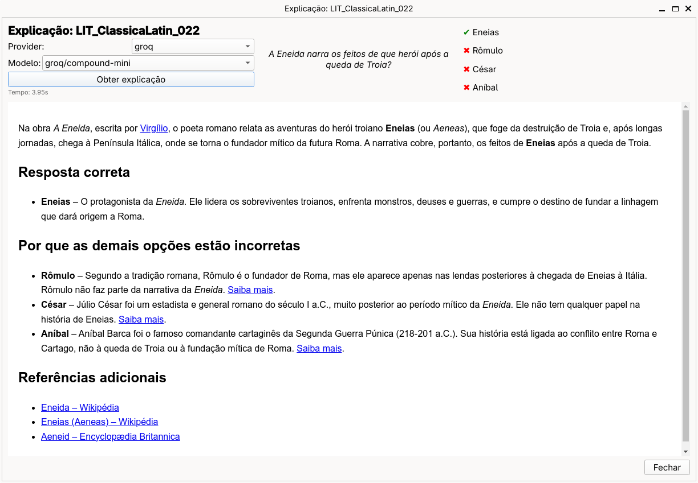
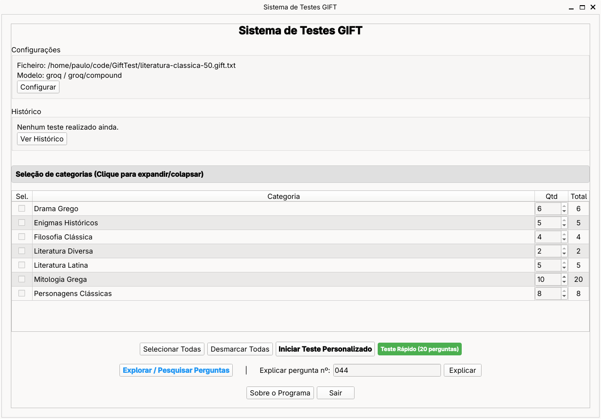

# Sistema de Testes GIFT

Aplicação para praticar perguntas em formato GIFT com possibilidade de explicar as respostas via serviços de IA.




## Dependências

A aplicação usa apenas bibliotecas Qt:

- `PyQt6` (widgets, layouts)

Instalação:

**Arch Linux:**
```bash
sudo pacman -S python-pyqt6
```

**Outras distros / venv:**
```bash
pip install -r requirements.txt
```

## Executar

```bash
python gift_test_practice.py
```

## Funcionalidades
- Seleção de categorias e número de perguntas
- Explicação de perguntas via LLM (Groq, Hugging Face, Gemini, Mistral, Perplexity, OpenRouter, Cloudflare)
- Configurações para ficheiro GIFT, provedor/modelo LLM e prompt
- Resultados com estatísticas e histórico
- Renderização HTML com QTextBrowser (leve e sem dependências extra)
- Zoom no conteúdo da explicação (Ctrl + roda do rato, Ctrl +/-, Ctrl + 0)
- Links abrem automaticamente no browser externo

## Configuração LLM
- Aceder a "Configurações" → LLM
- Configurar uma API_KEY (precisa de registo prévio, quase todos oferecem acessos free tier)
- Providers: Groq, Hugging Face, Google Gemini, Mistral, Perplexity, OpenRouter, Cloudflare
- Prompt padrão gera HTML formatado
- API keys guardadas localmente em `data/preferences.json`

## Estrutura
- `gift_test_practice.py`: aplicação principal (QMainWindow)
- `data/constants.py`: constantes da aplicação
- `data/selection_screen.py`: seleção de categorias
- `data/question_screen.py`: apresentação de perguntas
- `data/results_screen.py`: resultados e estatísticas
- `data/settings_screen.py`: configurações (ficheiro, LLM)
- `data/explanation_viewer.py`: visualizador HTML
- `data/gift_parser.py`: parser de ficheiros GIFT
- `data/llm_client.py`: cliente LLM (múltiplos providers)
- `data/preferences.py`: persistência de configurações
- `data/test_logger.py`: histórico de testes

## Notas
- Interface Qt6 moderna
- Tamanhos de janela configuráveis em "Configurações" (percentagem do ecrã)
- Executável Windows com ~21MB (compilado com Nuitka)
